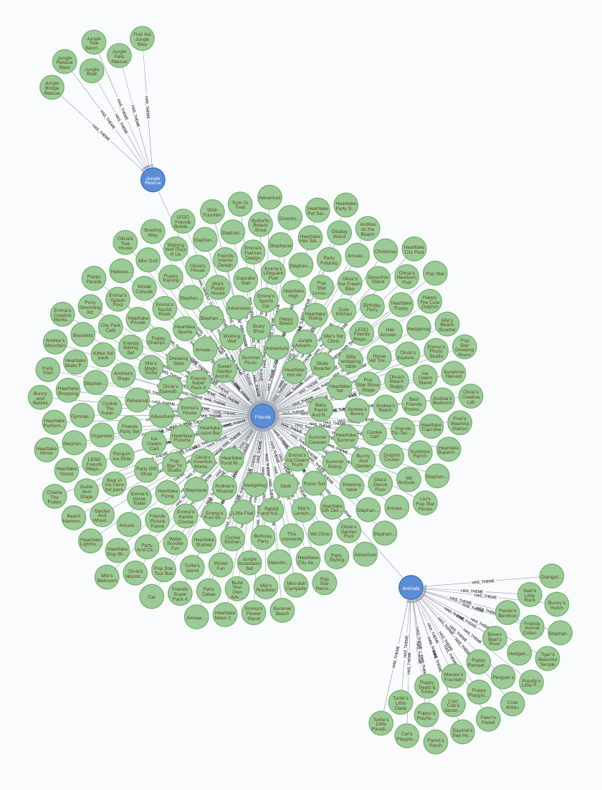
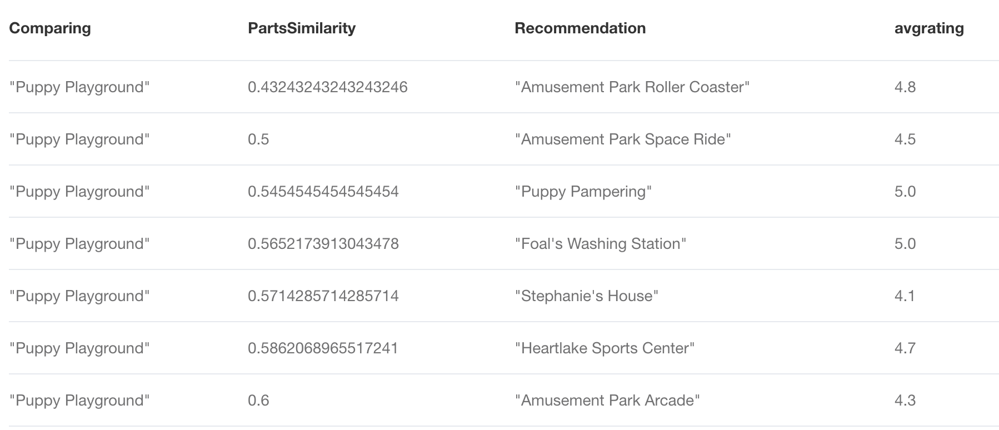
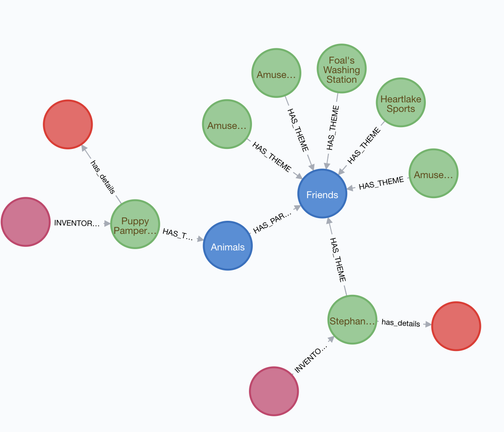

# Knowledge-Graph---Lego-Database (Recommendation System)

## Lego Project 

In this project, I have dived deep into understanding the connectedness of the large and complex nature of networks between sets and themes in the world of Lego using Graph database technology of Neo4j. 

## Problem Statement

The problem identified here is that Lego sets have shown decline in sales for past few years limiting the shelf space for newer products. 2018 saw the first decline in sales since a decade highlighting the need for Lego to make a shift in their marketing strategies for a turnaround in coming years.

## Possible Solutions

Using the world of graphs, we can offer multiple analytical solutions to drive business decisions at Lego. This ranges from recommender systems to smart inventory management. For this project, I mainly focused on the recommender system solution. 

## Solution - An effective recommender system using Neo4j capabilities

My solution is to design a recommender system which is able to provide personalized real time recommendations and help uncover some relevant patterns and insights using Cypher and Graph algorithms to help improve the sales of Lego sets. 

This repository will take you through the queries written in Cypher and the corresponsing output of the business queries which 
form the framework of my proposed recommendation system 

## A look at the lego graph database 

Here we have Sets, Themes, Inventory, Invetory Part, Color, PartCategory and Part. Unlike in RDBMS/NoSQL where recursive join operations are used to extract connectedness in data, Graph database allows us to extract relevant information using in-built relationships which give a boost to the performance time and speed of some complex queries which I have gone through in this project. 

## Additional Data Sources to enhance the solution 

Two additional datasets (CSV files) were incorporated in the graph database using LOAD CSV functionality in cypher to enhance the relevance of a recommender system. The relevant data was merged in the graph database in form of "Features" and "Information" node labels. The queries to make the necessary transformation from text file to graph format can be found in https://github.com/MB4511/Knowledge-Graph---Lego-Database/blob/master/Lego-Additional%20Data%20Ingestion.cql.txt. Below is how the updated graph database looks like. 

## Exploring the connectedness of the network of themes and sets 

The above snap from GraphXR visualization shows how sets have formed a network as they are developed on a theme where these themes themselves have a parent/central theme attached which really forms the core component for a recommender system to unravel. The visualization capability of Neo4j and graph database in general can be beneficial for some complex pattern identification which I have gone through using some insightful cypher queries in https://github.com/MB4511/Knowledge-Graph---Lego-Database/blob/master/Lego-Complex%20queries:%20Recom%20System.cql.txt.

## Some insightful cypher queries for Exploratory Data Analysis

Here are a few insightful cypher queries which capture some deep level relations between the entities in a matter of few milliseconds to a few seconds. For more queries, refer to https://github.com/MB4511/Knowledge-Graph---Lego-Database/blob/master/Lego-Exploration%20Queries.cql.txt 

### 1) // Top 3 themes per year

match (s:Set)-[:HAS_THEME]-(t:Theme) with s.year as year, t.name as theme, count(t.name) as frequency order by year desc, frequency desc 
return year, collect(theme)[0..3] as listofthemes

Runtime: 0.2 seconds

It is interesting to note that there has been a shift from traditional building bricks concept in themes like Basic set, supplemental (which were more popular in late 90s and early 2000s) to more digital experience based sets revolving around Batman, Star Wars, Ninjago etc in recent years. 

The output can be accessed using https://github.com/MB4511/Knowledge-Graph---Lego-Database/blob/master/top3themesperyear.csv file

### 2) // Analyzing themes with Avg Rating and Avg Price

MATCH (Set)-[:HAS_THEME]-(Theme),(Set) -[:has_features]- (features) where Theme.name in ['Star Wars','Batman','Basic Set','Ninjago','Friends','Duplo','Easter','Technic']                   
with Theme.name as theme, avg(tofloat(features.price)) as avgprice order by Theme.name                      
MATCH (Set)-[:HAS_THEME]-(Theme),(Set) -[:has_details]- (information)   
where Theme.name in ['Star Wars','Batman','Basic Set','Ninjago','Friends','Duplo','Easter','Technic']             
with theme, avgprice, Theme.name as themetwo, avg(tofloat(information.star_rating)) as avgrating order by themetwo 
where theme=themetwo 
return theme, avgprice, avgrating order by avgrating desc

Runtime: 4.8 seconds

Interesting to note that the themes revolving around digital space which have been more popular in recent times have recieved slightly lower ratings on average than the earlier ones such as basic set, duplo etc. Price wise the avg has not changed significantly over the years, this could be due to the fact that a lot of minifigs in these themes have started to develop which are not priced too high bringing the average price lower. 

### 3) // Number of distinct colors used per theme

MATCH (Color) < - [:HAS_COLOR]-(InventoryPart)-[:ASSOCIATED_INVENTORY]->(Inventory)-[:INVENTORY_FOR]->(Set)-[:HAS_THEME]-(Theme)                     
 RETURN Theme.name as theme, count(distinct Color.name) as distinctcolors order by distinctcolors desc
 
 runtime: 2.6 seconds 
 
 This query on any relational database format would require 4 joins and aggregation of count which would be time consuming but cypher is able to execute this query in a few seconds by extracting relationship path from colors to themes.

The output can be accessed using https://github.com/MB4511/Knowledge-Graph---Lego-Database/blob/master/distinctcolorspertheme.csv 

### 4) // Show top 5 colors used per theme

MATCH (Color) < - [:HAS_COLOR]-(InventoryPart)-[:ASSOCIATED_INVENTORY]->(Inventory)-[:INVENTORY_FOR]->(Set)-[:HAS_THEME]-(Theme)                      
WITH Theme.name as theme, Color.name as color, count(*) as usage order by theme, usage desc               
WHERE theme in ['Basic Set','Supplemental','Classic Town','Batman','Ben 10','Star Wars','Friends']                             Return theme, collect(color)[0..5] as top5colorsused

runtime: 3.2 seconds

Here we notice that how over the years tertiary colors like Light Bluish Gray, Dark bluish gray, Tan, Medium Azure have become important colors in making of sets revolving around entertainment themes whereas earlier themed sets mainly relied on the primary colors of red, green, yellow, white. 

### 5) // Top 3 Partcategories in each theme sorted in descending order

MATCH (pc:PartCategory)< -[:HAS_PART_CATEGORY]-(p:Part)< -[:FOR_PART]-(ip:InventoryPart)-[:ASSOCIATED_INVENTORY]-(inv:Inventory)-[:INVENTORY_FOR]- > (s:Set)-[:HAS_THEME]-(t1:Theme)  
where t1.name in ['Friends','Batman','Basic Set','Supplemental','Duplo','Star Wars']
with t1.name as Themename, pc.name as PartCategory, count(*) as frequency order by Themename, frequency desc                   return Themename, collect(PartCategory)[0..3] as Top3parts

runtime: 0.4 seconds

This query runtime really shows the power of cypher to calculate intricate relationships in data and perform quick aggregations in no time. A traditional database would require 6 joins (part category to theme) highly degrading the  performance of query. 

The output here shows us how modern day themes are using more and more plates and minifigs replacing the dominance of bricks in the lego sets to some extent. 

## Recommender System Framework 

I spent a lot of thought in deciding an effective framework for a recommender system taking into account relevance and diverse nature of recommendations since Toy industry relies on the concept of newness to attract the attention of kids and young teens and even parents who ultimately make the buying decision most of the times. Here the concept of similarity is key. The question really is on what basis can we identify 2 sets similar? It could be color, rating, price of set, recency of the manufactured set etc. I finally decided to use similarity on the basis on the parts the sets contain since parts become the building blocks of a set. 

A lot of cypher queries to get insights on similarity between sets on different attributes can be found in https://github.com/MB4511/Knowledge-Graph---Lego-Database/blob/master/Lego-Complex%20queries:%20Recom%20System.cql.txt

Here I will go through some of them and the final recommendation query. 

For demonstration purposes I would like to find recommendations for a set named 'Puppy Playground'

Set: Puppy Playground

### // Recommendation 1- Same theme Mentality

MATCH (s:Set{name:'Puppy Pampering'})-[:HAS_THEME]->(t:Theme)<-[:HAS_THEME]-(rec:Set)                            
RETURN rec

.png)

Here all the recommendations are based on the same themed sets. So all other sets which belong to Animals theme act as recommendations. 

However, this is quite a naive recommender system and does not really capture true relevance of connectedness of themes in the network which led me to work on the heirachical nature of themes. 

### // Community Detection Using Louvain Algorithm

#### // Finding communities of themes in this network of sets and themes and parent themes

#### // Using Louvain with node id

CALL algo.louvain.stream("Theme", "HAS_PARENT_THEME", {})
YIELD nodeId, community 

#### // Theme name along with community 

MATCH (t:Theme) WHERE EXISTS(t.louvain)
 RETURN DISTINCT t.name as entity, t.louvain AS louvain LIMIT 25 UNION ALL MATCH ()-[r]-() WHERE EXISTS(r.louvain) RETURN DISTINCT "relationship" AS entity, r.louvain AS louvain LIMIT 25

Helps us identify hierarchy of themes by grouping them in communities

### // Find all themes and order them by community and PageRank scores
MATCH (t:Theme)
WITH t
ORDER BY t.louvain, t.pagerank DESC
// Return top 10 ranked themes grouped by community
WITH  t.louvain AS community, collect(t.name) AS themes
RETURN community, themes[..10], size(themes) as sizeofcommunity
ORDER BY size(themes) DESC

The output can be accessed using https://github.com/MB4511/Knowledge-Graph---Lego-Database/blob/master/louvaincommunity.csv

However, the best way to understand the gritty knitty of Louvain community detection algorithm is to visualize the communities in Neuler/Graph algorithm playground by Neo4j. It allows us to see the importance of nodes in these communities through various angles. Degree and pagerank are two such factors which helps evaluate how themes are connected to each other and which 
themes are more influential in the network of themes. 

### Bionicle-Most Important Theme based on number of themes connected to it directly

Here we observe that 38 other themes have BIONICLE as their parent theme. So degree of Bionicle theme is 38.

### Town-Most Important Theme based on influence levels (connectivity with other parent themes/second degree connections)

Town on the other hand has 14 direct connections with themes for which it is a parent theme. Hence degree of Town theme is 14. However, page rank score of Town (7) is higher than that of Bionicle (4.99). This is because of these 14 connections, Town is connected to more influential themes which here means that some of these themes themselves act as a parent theme for many other themes. This really helps us understand how these different themes are connected and how can we use this heirarchy of themes to introduce it in our recommender system.

### Recommendation 2-Heirarchical themes into account 

Continuing efforts to recommend sets similar yet diverse to Puppy Playground we use heirarchy of themes using variable length path of the Animals theme.

MATCH (S:Set{name:'Puppy Playground'})                                         
 MATCH path=(S)-[*1..2]- > (t:Theme) < - [*1..2] - (rec:Set)                  
Return *

Returns 223 sets containing Animals, Friends or Jungle Rescue as their theme since these three themes form a heirarchical community. 

But, the first thing that comes to mind here is that 223 recommendations is taking us back to the core of the problem i.e. too many sets per theme. Therefore we need to use this context of heirarchy nature of themes with relevance and filtering out the most important or likely recommendations based on the user. Since we do not have user/customer information on purchases and demographics for now, we can filter using features like customer rating and item-similarity (set similarity in this case) metrics. 

### Recommendation 3- filtering relevance out of the Heirarchical themes on the basis of avg ratings given by users to sets

MATCH (S:Set{name:'Puppy Playground'})                                         
 MATCH path=(S)-[*1..2]- > (t:Theme) < - [*1..2] - (rec:Set) -[:has_details] ->(i:information)  WHERE tofloat(i.star_rating) > 4.0      
 RETURN * order by i.star_rating desc
 
 
 
 By filtering for the sets which have recieved over 4 star rating from these 3 themes of a community we are left with just 12 sets of recommendation. 
 
## Leveraging Jaccard similarity between parts of the sets to get a similarity score 
 

MATCH (pc:PartCategory)< -[:HAS_PART_CATEGORY]-(p:Part)< -[:FOR_PART]-(ip:InventoryPart)-[:ASSOCIATED_INVENTORY]-(inv:Inventory)-[:INVENTORY_FOR]- > (s1:Set) 
where s1.name= 'Puppy Playground' 
with s1.name as setone, toint(pc.id) as PartCategoryIdone, count(*)  as occurenceone  order by occurenceone desc                
 with setone, collect(PartCategoryIdone) as listofpartcategoryone
MATCH (pc:PartCategory)< -[:HAS_PART_CATEGORY]-(p:Part)< -[:FOR_PART]-(ip:InventoryPart)-[:ASSOCIATED_INVENTORY]-(inv:Inventory)-[:INVENTORY_FOR]- > (s1:Set)-[:HAS_THEME]-(t1:Theme)
where t1.name in ['Friends','Jungle Rescue','Animals']
with setone, listofpartcategoryone, s1.name as settwo, toint(pc.id) as PartCategoryIdtwo, count(*)  as occurencetwo  order by occurencetwo desc 
with setone, listofpartcategoryone, settwo, collect(PartCategoryIdtwo) as listofpartcategorytwo
Return setone as Set1, settwo as Set2, algo.similarity.jaccard( listofpartcategoryone, listofpartcategorytwo) AS PartSimilarityScore order by PartSimilarityScore desc

The output can be accessed using https://github.com/MB4511/Knowledge-Graph---Lego-Database/blob/master/partsimilarity.csv
 
Runtime: 1.9 seconds 

 ###  Final Recommendations - Recommending novel, diverse and relevant sets by incorporating similarity and customer rating
 
 MATCH (pc:PartCategory)< -[:HAS_PART_CATEGORY]-(p:Part)< -[:FOR_PART]-(ip:InventoryPart)-[:ASSOCIATED_INVENTORY]-(inv:Inventory)-[:INVENTORY_FOR]- > (s1:Set) 
where s1.name= 'Puppy Playground' 
with s1.name as Comparing, toint(pc.id) as PartCategoryIdone, count(*)  as occurenceone  order by occurenceone desc                
 with Comparing, collect(PartCategoryIdone) as listofpartcategoryone
MATCH (pc:PartCategory)< -[:HAS_PART_CATEGORY]-(p:Part)< -[:FOR_PART]-(ip:InventoryPart)-[:ASSOCIATED_INVENTORY]-(inv:Inventory)-[:INVENTORY_FOR]- > (s1:Set)-[:HAS_THEME]-(t1:Theme)
where t1.name in ['Friends','Jungle Rescue','Animals']
with Comparing, listofpartcategoryone, s1.name as Recommendation, toint(pc.id) as PartCategoryIdtwo, count(*)  as occurencetwo  order by occurencetwo desc 
with Comparing, listofpartcategoryone, Recommendation, collect(PartCategoryIdtwo) as listofpartcategorytwo
with Comparing,Recommendation, algo.similarity.jaccard( listofpartcategoryone, listofpartcategorytwo) AS PartSimilarityScore          with Comparing,Recommendation,PartSimilarityScore                            MATCH (S:Set)-[:has_details]-(I:information) where S.name = Recommendation  with Comparing,Recommendation, PartSimilarityScore, avg(tofloat(I.star_rating)) as avgrating                                      where PartSimilarityScore <= 0.60 and avgrating > 4.0                        return * order by avgrating desc

Final Results - Tabular Format

Final Results - Graph Format

Finally this query brings everything together, the relevance by incorporating parts similarity between sets and diversity of the themes which are heirarchical in nature and using the ratings we can take well recieved sets into account. As a result, we get a list of these 7 recommendations in the recommendations column with their accompanying PartSimilarity score and avg rating recieved. 

However, in calculating the similarity between Puppy Playground and all the sets in the community, I decided to go for sets which are not more than 60% similar and have a higher rating than 4. My rationale behind going for a lower similarity score between sets is due to the fact that newness of a lego set would largely depend on the parts it constitutes and personally I believe that offering newness in form of new and different parts and shapes to play with not only attracts the young kids and teens but also gives an incentive to parents to make a purchasing decision since this recommended lego set is a bit different in terms of parts it contains but relevant since it is related to the theme which the kid wants/likes. 

These threshold values could be tweaked based on the performance of the recommender system over time but this framework can help Lego attract their customers who are missing out on the diverse set of products which are in store for them. 

